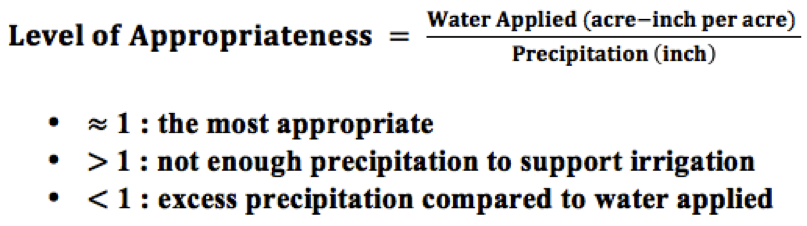

Our topic is on crops selection in San Joaquin Valley in California. Droughts have stocked California in the past 6 years and it has been eased a little due to recent rain. However, the severe effect from drought is still influencing California. Last Month, NASA published a report mentions that lands in San Joaquin Valley are sinking into the ground. Some areas are sunk for more than a feet in a year. This is caused by the fact that too much ground water has been drawn from the ground and most of those water goes into agriculture.  

Meantime, about 13% of US agriculture production came from San Joaquin Valley. It is a challenge to find the balance between reducing water usage in agriculture and keeping the crops production going. We investigate the appropriate crops to grow and trends in crops areas in the past 6 years. Ideally, we want to help farmers make decisions on what to grow, and help the government to get ideas of current water usage in agriculture in San Joaquin Valley. 

## Data Cleaning and Munging Before Analysis 

We had our data from 5 resources, and we merged by common features across tables. For tables that don't have common features, we create features which can be used to merge the other tables. For example, in the Cropland Data Layer(CDL) excel, we created county name based on the locations of subbasins so that this table can be merged with Water Usage for crops by county. The highlighted feature in the table below are the common features. We also web-scrape precipitation store in API format from the Internet and manually summarized crops' economic value from reading pdf files from the website. Here are lists of our data sources

  - [Basin Information](https://www.nass.usda.gov/Research_and_Science/Cropland/Release/)
     The UC Davis Water and Energy Efficiency Center Processed this data into Excel Format.<a href="mailto:liyanlinalice@hotmail.com"> Contact us </a> if you want to download the file  
  - [Agriculture Water Usage By County](http://www.water.ca.gov/landwateruse/anlwuest.cfm)
  - [Basin Shapefile](https://www.arcgis.com/home/item.html?id=23e7bea1720142fe877295b3a44232af)
  - [Zipcode and Precipetation](http://et.water.ca.gov/Rest/Index)
  - [Crop Economic Value](https://www.nass.usda.gov/Statistics_by_State/California/Publications/)
  - [Other Useful Information on Subbasin](https://gis.water.ca.gov/app/bbat/)
  - [Data Ready For Analysis](https://www.dropbox.com/s/q566iqo0gj38d2o/SubB_Yr_Cnty_Crp_Wtr_Acr_Zip_Prcip_Ecn.xlsx?dl=0)
  - Link to our [iPython Notebook](https://github.com/ZoeyYiZhou/141BProject/tree/master/zJupyterNB_Script) in Preprocesing Data

## Data Analysis/Visulization  

We create a new variable 'appropriateness' by using water usage per acre divided by percipitation from our dataset.Ideally, if the precipitation happens to be equal to the total water crops needed to grow, our definied 'appropriateness' will be '1'. In this case, farmers do not need to draw more water from the ground. However, usually the appropriateness will be bigger than '1', as the crops in general need more water than precipitation. An appropriateness value close to '1' indicates a higher appropriateness in growing the crop in given area. 

## Ready? Here are our analysis results. For each graph below, we also have link to its interactive plot . 

This is a bar plot showing the trend for crop area, precipitation and crop economic value from 2010 to 2015. We standardized the value of area, economic value and precipitation and put them into one bar plot. We can see that the precipitation of San Joaquin valley dropped significantly since 2011 except year 2013. The trend in crop areas is consistent with precipitation. This fact proves that agriculture production is severely affected by the lack of rains. Economic value of crops reaches its maximum in 2011 and starts to drop each year afterwards, and reaches the minimal value in 2015. Overall, we can see that agriculture production is severely affected by the lack of rains, and experiences a decrease in production from economics aspect. Click [here](zhtml/Area_Value_Precipitation_Trends.html) for the interactive plot. 

In this graph, we separate the crops by three tiers according to their water usage. We rank the crops by unit water usage in 2010. Top 10% of crops in terms of water usage is named high water usage crops. Bottom 40% of crops in terms of water usage is named low water usage crops. The rest is medium water usage crops. We can see that the area of high water usage crops have decreased dramatically since 2010. The area of low water usage crops has increased by a comparably smaller amount since 2010. Medium water usage crops kept relatively constant. It shows that farmers have been trying to grow more low water usage crops and less high water usage crops. Click [here](zhtml/Area_Trends_For_Crops.html) for the interactive plot. 
  
 

We calculate appropriateness level for all crops in all 18 subbasins and plot their appropriateness in ascending order in one plot. The picture above only shows the appropriateness for crops in two subbasins: Chowchilla and Madera. Each bar represents a crop in selected subbasin. From the plot, we see that grain, tropical plant and potatoes are the top 3 water-saving crops in San-Joaquin Valley. To view crops in other subbasin and compare crop appropriateness across the basins, click the subbasin on the legend on [the interactive plot](zhtml/2_bars.html), it will toggle the plot to filter by sub-basin.

According to sthe water appropriateness levels, in each Subbasin, we pick the top 50% crops (approx 7 crops) in terms of best water appropriateness. Among these top water saving crops, we rank them by production economics value and project the top 3 economic crops for each subbasin.  Using the criteria, for example, we suggest farmers from Turlock to grow safflower, field crop, and tropical plant. Simply click a data point(subbasin location) on this [interactive map](zPrj_map/SJV_basin.html), you will see the suggested crops to grow in the area. 

Some crops appear more than once in the suggested crops for 18 sub-basins, whereas some crops never appear in the suggested crops section. Next, we focus our analyze on crops that we do not recommend to grow: alfalfa, grain and corn. 

We plot the areas in growing alfalfa, grain and corn to show trends in cropping areas. These 3 widely grown plants in San Joaquin Valley have high water consumption, but low economic values. Note that alfalfa is used for grazing, hay, and silage. In the bars for alfalfa, the area of alfalfa has dropped significantly, but the total area in growing alfalfa is still significant. Similar trends happened for both grain and corn. It will be a better idea if California can import alfalfa, grain, and corn, or find their substitutes to grow to save water.[Corn_Alfalfa_Grain_Trends](zhtml/Corn_Alfalfa_Grain_Trends.html)

In this plot above, we analysis other 3 crops: potato, melon and cucumber, and deciduous plant. These crops don't need too much water to grow and can be sold with medium prices, so they are never in the suggested list. However, if we were to find the best place to grow these crops using their appropriateness in each county ranking, we recommend Chowchilla, Madera and Kaweah sub-basin to plant potato, Delta-Mendota, Modesto and Turlock to grow Melon and Cucumber, and Cosumnes, Eastern San Joaquim and Tracy to grow Deciduous Plant. More details on [interactive plot](zhtml/Mid_Three_Crops.html)

Overall, we notice that some farmers in San Joaquin Valley have switched their crops and adjust to the drought conditions in San Joaquin Valley to decrease the water use, but there are certainly some rooms for improvement in terms of saving water. Our suggestions are merely based on production economic value and water usage saving. There might be other factors for farmers to consider if they decide to switch, for example, diet habit for people around the area, consumers' purchasing habits in the area and etc, which we did not consider here. However, what we did here gives farmers a good overview on possible crops to grow if they want to improve water usage.  

### Thanks for viewing our website! 
Link to [iPython Notebook](https://github.com/ZoeyYiZhou/141BProject/tree/master/zJupyterNB_Script) on Data Analysis/Visulization

<dl>
<dt>Free free to contact us if you have any questions!</dt>
<a href="mailto:liyanlinalice@hotmail.com"> Alice, Li</a>;  
<a href="mailto:zoezhou@ucdavis.edu"> Yi, Zhou</a>;   
<a href="mailto:umama@ucdavis.edu"> Jun, Ma</a>;  
<a href="mailto:kaij5088@gmail.com"> Kai, Jin</a> 
</dl>

